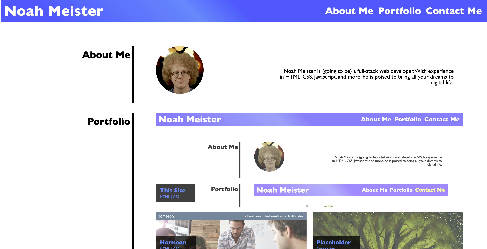

# UTA Coding Bootcamp Challenge 1

## Description

This is my submission for the second challenge in the UTA/EdX Coding Bootcamp. The goal of this challenge was to create a sample portfolio using HTML and CSS.
I created a site with rudimentary About Me, Portfolio, and Contact me sections that I can update as I gain more experience through this course and elsewhere.

<a href="https://njmeister.github.io/UTA-bootcamp-challenge-2/">Link</a>

## Installation

N/A

## Usage

The website serves as a sample web developer portfolio for myself. Clicking on the non-placeholder images will take you to the websites I have deployed.

## Credits

N/A

## License

This repo uses an MIT License. See above for details.
